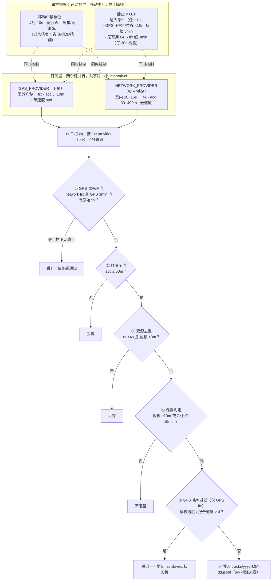

# 行程轨迹 (LocationTracker)

一个为国内环境设计的**轨迹记录 Android 应用**：无 GMS 依赖、原生 `LocationManager` 双源定位、在线 OSM 矢量底图（OpenFreeMap，4 种风格可选）、按日 JSONL 存储、自带历史回放与 GPX/CSV 导出。

---

## 下载安装

到 [Releases](https://github.com/wuhulamb/tracker-app/releases) 下载最新 `location-tracker-<版本>.apk`，手机上直接安装（首次需允许「安装未知应用」）。

构建、测试与发布流程见 [BUILD.md](BUILD.md)。

## 项目结构

```
app/src/main/java/com/xu/locationtracker/
├── LocationApp.kt          Application 初始化：Prefs/Store/MapLibre/通知渠道
├── MainActivity.kt         Compose 入口
├── data/                   存储与领域模型
│   ├── TrackPoint.kt       JSONL 行模型 + dayKeyOf
│   ├── TrackStore.kt       按日 JSONL 读写（Mutex 串行）
│   ├── ReplayModel.kt      回放时间轴压缩与插值（纯逻辑，可单测）
│   ├── Prefs.kt            设置项与策略常量
│   └── TrackerState.kt     进程内共享 StateFlow（服务写、UI 读）
├── service/                后台
│   ├── TrackingService.kt  前台服务：定位订阅 + 保存策略 + 通知
│   ├── SavePolicy.kt       去重/保存/静止/毛刺判定（纯逻辑，可单测）
│   ├── MotionProfile.kt    运动档位（速度→采样间隔，纯逻辑，可单测）
│   └── BootReceiver.kt     开机自启
├── ui/                     界面
│   ├── MainScreen.kt       Scaffold + 底部导航
│   ├── MapScreen.kt        地图 + 回放 + 状态卡片 + 指南针
│   ├── HistoryScreen.kt    历史日期列表
│   ├── SettingsScreen.kt   设置
│   ├── MainViewModel.kt    ViewModel
│   └── MapStyles.kt        底图样式（在线 OpenFreeMap）
└── util/
    ├── Export.kt           GPX/CSV 导出
    ├── Stats.kt            轨迹统计 / 球面距离
    ├── Gcj.kt              WGS-84 → GCJ-02（备用）
    └── Fmt.kt              时长/定位新鲜度文案
```

## 数据存储

- **轨迹点**：`/sdcard/Android/data/com.xu.locationtracker/files/tracks/yyyy-MM-dd.jsonl`（每天一个文件，每行一个点）
- **导出**：系统「下载/行程轨迹/」下的 GPX / CSV

单行格式：`{"t":时间戳,"lat":纬度,"lon":经度,"acc":精度米,"spd":速度m/s,"prv":"gps|network"}`（缺 `prv` 的行视为非法并丢弃）

## 定位策略

**GPS 优先，网络兜底**：GPS 正常工作时忽略网络 fix（WiFi 定位误差可达数百米且滞后，混存会污染轨迹）；GPS 连续失效超过 3 分钟后网络 fix 才作为兜底保存。采样频率按**运动档位**自适应：移动中按平滑速度分档（步行 10s / 骑行 6s / 驾车、高速 3s，记录精度档可调）；静止时 60s，进入条件为「位移小持续 5min」或「无可用 GPS fix 超 3min」。



## 底图

在线 OSM 矢量底图 [OpenFreeMap](https://openfreemap.org)（shortbread schema，WGS-84，轨迹点直接叠加、无需纠偏），数据源 `tiles.openfreemap.org/planet`。

内置官方 4 种样式，设置页「地图样式」切换（返回地图页生效）：**亮色**（默认）/ **浅色** / **暗色** / **深蓝**，资源在 `app/src/main/assets/styles/ofm_<style>.json`。

注意：服务器位于国外，需手机能直连 `tiles.openfreemap.org`，网络不通时地图为空白背景色。

## 许可

仅供个人学习使用。底图数据 © OpenStreetMap contributors（经 OpenFreeMap 分发，Zlib 许可）；轨迹数据归记录者本人。
