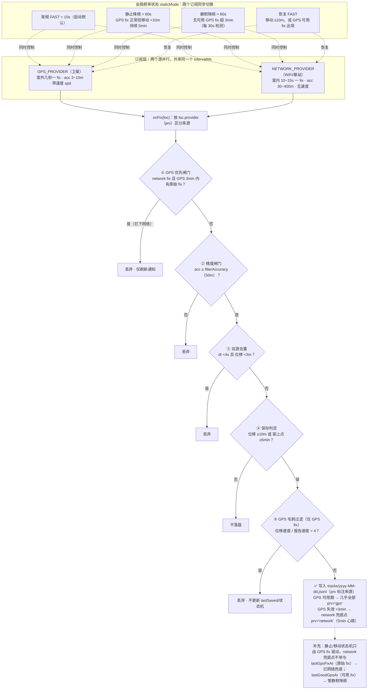

# 行程轨迹 (LocationTracker)

一个为国内环境设计的**离线轨迹记录 Android 应用**：无 GMS 依赖、原生 `LocationManager` 双源定位、高德瓦片底图（GCJ-02 坐标纠偏）、按日 JSONL 存储、自带历史回放与 GPX/CSV 导出。

---

## 项目结构

```
app/src/main/java/com/xu/locationtracker/
├── LocationApp.kt          Application 初始化：Prefs/Store/MapLibre/通知渠道
├── MainActivity.kt         Compose 入口
├── data/                   存储与领域模型
│   ├── TrackPoint.kt       JSONL 行模型 + dayKeyOf
│   ├── TrackStore.kt       按日 JSONL 读写（Mutex 串行）
│   ├── ReplayModel.kt      回放时间轴压缩与插值（纯逻辑，可单测）
│   ├── Prefs.kt            设置项封装
│   └── TrackerState.kt     进程内共享 StateFlow（服务写、UI 读）
├── service/                后台
│   ├── TrackingService.kt  前台服务：定位订阅 + 保存策略 + 通知
│   ├── SavePolicy.kt       去重/保存/静止判定（纯逻辑，可单测）
│   └── BootReceiver.kt     开机自启
├── ui/                     界面
│   ├── MainScreen.kt       Scaffold + 底部导航
│   ├── MapScreen.kt        地图 + 回放 + 状态卡片
│   ├── HistoryScreen.kt    历史日期列表
│   ├── SettingsScreen.kt   设置
│   ├── MainViewModel.kt    ViewModel
│   └── MapStyles.kt        在线/离线样式
└── util/
    ├── Gcj.kt              WGS-84 → GCJ-02
    ├── Exporter.kt         GPX/CSV 导出
    ├── Stats.kt            轨迹统计 / 球面距离
    └── Fmt.kt              时长/定位新鲜度文案
```

## 构建与安装

```bash
# 需要 Android SDK（local.properties 中 sdk.dir 指向本机 SDK）
./gradlew :app:assembleDebug
adb install -r app/build/outputs/apk/debug/app-debug.apk

# 运行单元测试（纯逻辑，无需设备）
./gradlew :app:testDebugUnitTest
```

运行测试输出示例：

```
GcjTest          5 tests, 0 failures
ReplayModelTest  6 tests, 0 failures
SavePolicyTest   4 tests, 0 failures
```

## 数据存储

| 内容 | 位置 |
|---|---|
| 轨迹点（JSONL，每天一个文件） | `/sdcard/Android/data/com.xu.locationtracker/files/tracks/yyyy-MM-dd.jsonl` |
| 离线地图 | `/sdcard/Android/data/com.xu.locationtracker/files/maps/shanghai.mbtiles` |
| 导出文件 | 系统"下载/行程轨迹/" |

单行格式：`{"t":毫秒时间戳,"lat":纬度,"lon":经度,"acc":精度米,"spd":速度m/s,"prv":定位来源}`

`prv` 为必填定位来源字段（`gps` / `network`）；解析时缺失 `prv` 的行视为非法数据被丢弃（历史数据已统一补齐该字段）。

定位策略：**GPS 优先，网络兜底**——GPS 正常工作时忽略网络 fix（WiFi 定位误差可达数百米且滞后，混存会污染轨迹）；GPS 连续失效超过 3 分钟后网络 fix 才作为兜底保存。另外，距最后一次"可用 GPS fix"超过 3 分钟自动降频到静止采样间隔（室内/无信号时省电），GPS 恢复可用 fix 后立即拉回常频。

### 定位工作逻辑



## 离线地图（可选）

应用默认使用高德在线瓦片。需要离线底图时：

```bash
# 生成上海 10-18 级离线包（无网络瓦片缓存时用）
python3 tools/download_tiles.py maps/shanghai.mbtiles

# 推送到手机后重启应用
adb push maps/shanghai.mbtiles /sdcard/Android/data/com.xu.locationtracker/files/maps/
```

## 许可

仅供个人学习使用。地图瓦片版权归高德；轨迹数据归记录者本人。