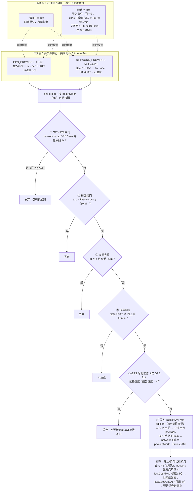

# 行程轨迹 (LocationTracker)

一个为国内环境设计的**离线轨迹记录 Android 应用**：无 GMS 依赖、原生 `LocationManager` 双源定位、高德瓦片底图（GCJ-02 坐标纠偏）、按日 JSONL 存储、自带历史回放与 GPX/CSV 导出。

---

## 项目结构

```
app/src/main/java/com/xu/locationtracker/
├── LocationApp.kt          Application 初始化：Prefs/Store/MapLibre/通知渠道
├── MainActivity.kt         Compose 入口
├── data/                   存储与领域模型
│   ├── TrackPoint.kt       JSONL 行模型 + dayKeyOf
│   ├── TrackStore.kt       按日 JSONL 读写（Mutex 串行）
│   ├── ReplayModel.kt      回放时间轴压缩与插值（纯逻辑，可单测）
│   ├── Prefs.kt            设置项封装
│   └── TrackerState.kt     进程内共享 StateFlow（服务写、UI 读）
├── service/                后台
│   ├── TrackingService.kt  前台服务：定位订阅 + 保存策略 + 通知
│   ├── SavePolicy.kt       去重/保存/静止判定（纯逻辑，可单测）
│   └── BootReceiver.kt     开机自启
├── ui/                     界面
│   ├── MainScreen.kt       Scaffold + 底部导航
│   ├── MapScreen.kt        地图 + 回放 + 状态卡片
│   ├── HistoryScreen.kt    历史日期列表
│   ├── SettingsScreen.kt   设置
│   ├── MainViewModel.kt    ViewModel
│   └── MapStyles.kt       底图样式（在线 OpenFreeMap）
└── util/
    ├── Gcj.kt              WGS-84 → GCJ-02
    ├── Exporter.kt         GPX/CSV 导出
    ├── Stats.kt            轨迹统计 / 球面距离
    └── Fmt.kt              时长/定位新鲜度文案
```

## 构建与安装

```bash
# 需要 Android SDK（local.properties 中 sdk.dir 指向本机 SDK）
./gradlew :app:assembleDebug
adb install -r app/build/outputs/apk/debug/app-debug.apk

# 运行单元测试（纯逻辑，无需设备）
./gradlew :app:testDebugUnitTest
```

运行测试输出示例：

```
GcjTest          5 tests, 0 failures
ReplayModelTest  6 tests, 0 failures
SavePolicyTest   4 tests, 0 failures
```

## 数据存储

| 内容 | 位置 |
|---|---|
| 轨迹点（JSONL，每天一个文件） | `/sdcard/Android/data/com.xu.locationtracker/files/tracks/yyyy-MM-dd.jsonl` |
| 导出文件 | 系统"下载/行程轨迹/" |

单行格式：`{"t":毫秒时间戳,"lat":纬度,"lon":经度,"acc":精度米,"spd":速度m/s,"prv":定位来源}`

`prv` 为必填定位来源字段（`gps` / `network`）；解析时缺失 `prv` 的行视为非法数据被丢弃（历史数据已统一补齐该字段）。

定位策略：**GPS 优先，网络兜底**——GPS 正常工作时忽略网络 fix（WiFi 定位误差可达数百米且滞后，混存会污染轨迹）；GPS 连续失效超过 3 分钟后网络 fix 才作为兜底保存。频率只有两档（行动中 10s / 静止 60s）：静止时进入条件为"位移小持续 5min"或"无可用 GPS fix 超 3min"，任意移动即恢复行动中。

### 定位工作逻辑



### 启动顺序（勿改）

服务启动后在一个**主线程协程**里按顺序做两件事：读当天 JSONL 恢复 `points` / `lastSaved` / `lastMovedAt` / `lastGoodGpsAt` → **完成后才** `requestLocationUpdates` 订阅定位（`TrackingService.startTracking`）。

这个顺序不能颠倒：恢复与 `onFix` 写的是同一批状态，而 `StateFlow.value = value + p` 是读-改-写、不原子。先订阅的后果：刚收到的点被磁盘快照整体覆盖（文件里有、UI 与统计一整天都缺这一段）、`lastSaved` 基准回退、`lastMovedAt` 回退到旧时间戳导致当场误判“静止”而降频。

同理，重复 `ACTION_START` 在“已在记录且当天已恢复”时直接返回（只刷一次通知），不重跑恢复与订阅 —— 否则会把静止降频打断、回到高频采样。代价：启动到首次定位推延几十毫秒。

## 底图（在线 OpenFreeMap）

应用使用**在线 OSM 矢量底图** OpenFreeMap（shortbread schema，WGS-84）：

- 数据源：`https://tiles.openfreemap.org/planet`（tilejson，全球 z0-15+，道路/地名数据完整）
- 样式：内置 OpenFreeMap 官方 4 种风格（`app/src/main/assets/styles/ofm_<style>.json`，已移除 ne2 影像阴影层；字体走 `tiles.openfreemap.org/fonts`）：

  | 值（内部） | 设置页名称 | 特点 |
  |---|---|---|
  | `bright` | 亮色 | 亮色底图（默认）|
  | `positron` | 浅色 | 极简浅色，无 POI |
  | `dark` | 暗色 | 深色底图 |
  | `fiord` | 深蓝 | 深蓝夜色 |

- 选择：设置页 → 「地图样式」，切换后返回地图页生效（写入 `Prefs.mapStyle`，`MapStyles.styleSpec` 按选项加载对应样式）
- 坐标系：WGS-84，轨迹点直接叠加，无需 GCJ 纠偏
- 注意：服务器位于国外，需手机能直连 `tiles.openfreemap.org`（网络不通时地图为空白背景色）

曾使用过的 maptoolkit 离线矢量包（浦东等郊区道路数据稀疏、高德底图需 GCJ 纠偏）均已移除，不再需要任何离线瓦片。

## 许可

仅供个人学习使用。底图数据 © OpenStreetMap contributors（经 OpenFreeMap 分发，Zlib 许可）；轨迹数据归记录者本人。